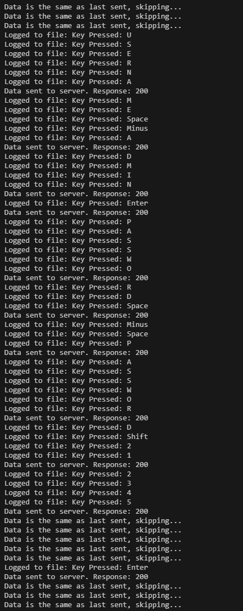
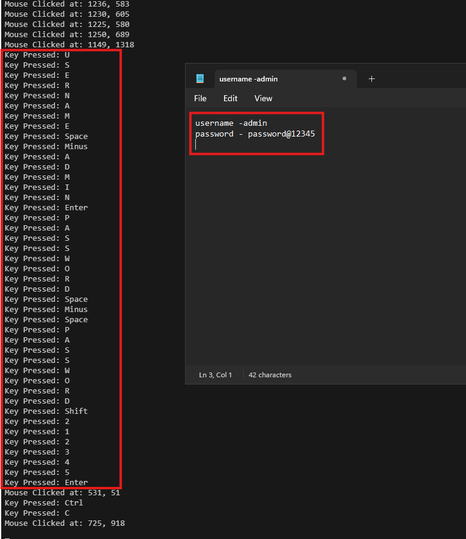

# Keylogger
A keylogger is a type of software device that secretly records the keystrokes (key presses and mouse clicks) made on a computer or mobile device. The primary purpose of keyloggers is to capture everything that is typed, including passwords, messages, and other sensitive information, without the user's knowledge. Keyloggers are often used for malicious purposes but can also have legitimate uses in certain contexts (such as parental control or corporate monitoring).

Here we made a java based keylogger which we tested on windows. It send out whatever is being captured every 1 second and we have also written a demo server program (keyloggerServer.java) to demonstrate how the attacker receives all the captured information.

we have opened notepad and written username and password this is to simulate how people open browser and  enter login credentials. From the screenshots below you,can see how the keylogger is capturing everything the user types along with the mouse clicks and how the attacker receives the same information

This keylogger project aligns with the reconnaissance and weaponization phase of the cyber-kill-chain, as this program weaponizes legitimate operating system hooks to harvest sensitive information.

## Live Capture
Keylogger client output

## Captured Data
Keylogger server capture data

## Next Steps
* We need to further test our keylogger program against multiple security softwares to make sure the program is not being detected. If is does get detected we need to work on enhancing our evasive capabilities.
* We need to improve on the organization of the captured data that is being sent to the attacker, to improve attackers user experience throughout the phase of this attack.
