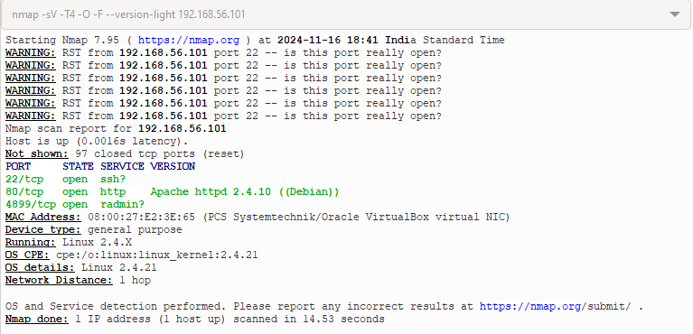
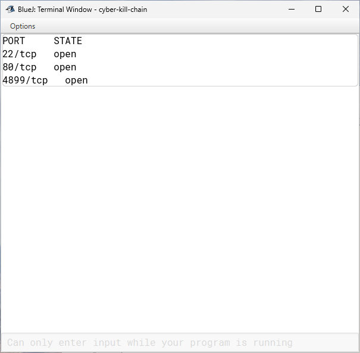

# Port Scanner
A port scanner is a tool or program used to detect open ports on a networked device (such as a computer or server) to assess its security and functionality. In networking, ports are logical access points that allow applications and services to communicate over a network, such as the internet. For example, port 80 is commonly used for web traffic (HTTP), and port 443 is used for secure web traffic (HTTPS).

Our port scanner program scans the top 1000 commonly used ports of a target IP adress. The target we used was a vulnerable virtual machine [Vulnerable Virtual Machine - 64BASE](https://www.vulnhub.com/entry/64base-101,173/). 

Port scanner is used for reconnaissance of a target system or network.

## Expected Output
Output from industry leading port scanning software

## Program Output
Output from our program

## Next Steps
* Update  the program to accept more than 1 IP address—it could be an IP range or multiple comma-separated IP addresses.
* Update the program to accept a list of ports to be scanned- it could be just a single port or a range or list of ports.
* Add parallel scanning to speed up the entire port scanning process.
* Add a functionality to detect if firewalls are dropping our port scan requests and adjust our scan intervals accordingly. 
* 
