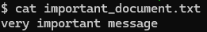
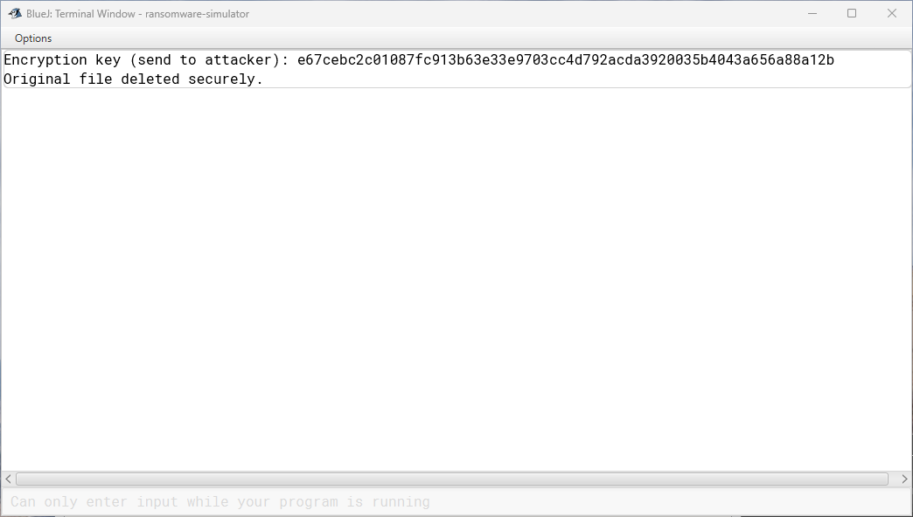
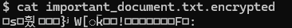

# Ransomware Simulator
A ransomware simulator is a tool or program designed to mimic the behavior of a ransomware attack. It is commonly used for cybersecurity training, testing, research, and raising awareness within organizations. These simulators replicate the actions of actual ransomware attacks without encrypting data or causing harm to systems. 

One common use case involves setting up a simulated ransomware infection where files appear to be encrypted, and users are "asked" to pay a ransom to decrypt them. This effectively simulates the threat without inflicting any damage. This approach aligns with the actions and objectives phase of the cyber kill chain, where the attacker has potentially completed all prior stages before achieving their ultimate goal, which may include sensitive data theft and a ransomware attack.

By utilizing a ransomware simulator, the attacker would have full control over the affected systems. The systems would be rendered inoperable due to the majority of the data being encrypted, followed by secure deletion to prevent data recovery. Consequently, the victim is left with no choice but to negotiate with the attacker for decryption keys, typically in cryptocurrency exchange.

## Plaintext
The original file **"important_document.txt"**

## Program Output
Output from our program

Encrypted File **"important_document.txt.encrypted"**

## Next Steps
- Modify the program to dynamically accept a list of directories that need to be encrypted.
- Enhance the program to transmit the encryption key to the attacker's command and control (C2) server.
- Conduct tests against common security products to verify the program's ability to evade detection.
