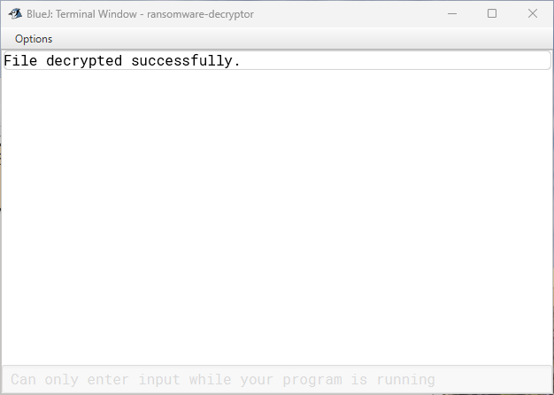

# Ransomware Decryptor
A ransomware decryptor is a tool designed to restore files that have been encrypted by ransomware. Ransomware attacks typically involve the encryption of files, with attackers demanding a ransom in exchange for the decryption key. In cases where the victim chooses not to pay the ransom or finds the demand suspicious or untrustworthy, decryption tools may be used to recover files, provided that a decryptor has been developed. These tools assist victims in recovering their data when possible.

This decryptor serves as an extension of the ransomware simulator program and corresponds with actions in the objectives phase of the cyber kill chain.

Attackers often drop this program before launching a ransomware attack, intending to provide victims with a means to recover their systems. However, the program is only useful to the victim if they receive the decryption keys from the attacker or if they are able to analyze or uncover the decryption keys independently, or with assistance from an information security team.

## Plaintext
The original file **"important_document.txt"**

## Program Output
Output from our program

Decrypted File **"important_document.txt.decrypted"**

## Next Steps
*Enhance the program to choose directories for decryption dynamically.
*Test it against common security products to ensure it remains evasive.
