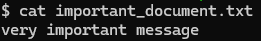

# Ransomware Decryptor
A ransomware decryptor is a tool designed to decrypt files that have been encrypted by ransomware. Ransomware attacks typically involve the encryption of files and demanding a ransom for the decryption key. In cases where the victim doesn't want to pay or where the ransom demand is suspicious or untrustworthy, decryption tools can be used to recover files, assuming a decryptor has been developed. It helps victims recover their data when possible.

This is an extension to the ransomware simulator program and aligns with actions on the objectives phase og the cyber kill chain.

This program is often dropped by the attackers before the ransomware attack as a means for the victim to recover their systems however this program is only used by the victim if they receive the decryption keys from the attacker, or the victim can analyze or [figure out the decryption keys on their own](https://www.nomoreransom.org/en/decryption-tools.html) or with the help of an information security team.

## Plaintext
The original file **"important_document.txt"**

## Program Output
Output from our program

Decrypted File **"important_document.txt.decrypted"**

## Next Steps
* Upgrade the program to dynamically choose directories to be decrypted.
*Test it out against common security products to make sure it is evasive in nature.
